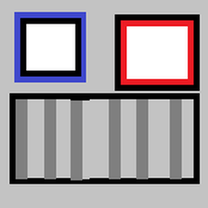

[](LICENSE)
[](https://github.com/blondberg/beatbob/issues?)


<br />

<div align="center">
  <a href="https://github.com/othneildrew/Best-README-Template">
    
  </a>
  <h3 align="center">Beatbob</h3>
  <p align="center">
    <i>A mediocre Discord music bot that 95% of the time works everytime.</i>
    <br />
    <br />
    Listen to music from
    <br />
 

    <br />
    <strong>together!</strong>
  
  </p>
</div>


## About
### Built with


## Getting started

### Prerequisites
* Python
* Pip
* Lavalink
  
### Installation 


### Run the bot

```bash
java -jar Lavalink.jar
```
```bash
python bot.py
```

## Roadmap
#### Commands
- [ ] `/shuffle` and `/loop` commands.
- [ ] Queue history and ability to play `/previous` tracks.
- [ ] `/remove` a song from queue.
- [ ] `/seek` through a song.
- [ ] `/move` a song in the queue.


#### Misc
- [ ] DJ-mode: playing a song from each user before repeating. 
- [ ] Docker support.
- [ ] Persistent guild settings (database support).
  - [ ] Queue.
  - [ ] Autoplay, loop, and shuffle.